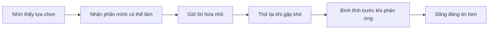

<section class="training-home">
  

    <a href="/ban-linh-training-web/vi/lessons/01-tinh-cach-la-lua-chon-nho/">Bài 1 <strong>Lựa chọn nhỏ</strong></a>
    <a href="/ban-linh-training-web/vi/lessons/03-trach-nhiem-la-phan-minh-co-the-lam/">Bài 3 <strong>Trách nhiệm</strong></a>
    <a href="/ban-linh-training-web/vi/lessons/05-khong-bo-cuoc-qua-som/">Bài 5 <strong>3 lần thử</strong></a>
    <a href="/ban-linh-training-web/vi/lessons/08-bo-quy-tac-ban-linh-cua-minh/">Bài 8 <strong>Quy tắc của mình</strong></a>
  

  

    <a class="course-card" href="/ban-linh-training-web/vi/tong-quan/">
      Tổng quan
      <strong>Hiểu mục tiêu thật sự của khóa học</strong>
      
Không hoàn hảo, không áp lực thắng thua. Bé học cách chọn hành động tốt hơn khi gặp việc khó.

    </a>
    <a class="course-card" href="/ban-linh-training-web/vi/lessons/">
      Bài học
      <strong>Học theo 4 tuần, 8 buổi</strong>
      
Đi từ tính cách, trách nhiệm, kỷ luật đến bình tĩnh, trung thực và bộ quy tắc bản lĩnh.

    </a>
    <a class="course-card" href="/ban-linh-training-web/vi/resources/">
      Tài nguyên
      <strong>Điền được ngay sau mỗi bài</strong>
      
Sổ tay, checklist và mẫu thực hành giúp bài học trở thành hành động nhỏ hằng ngày.

    </a>
    <a class="course-card" href="/ban-linh-training-web/vi/projects/">
      Dự án
      <strong>30 ngày tạo bằng chứng tiến bộ</strong>
      
Bé chọn mục tiêu vừa sức, theo dõi bằng chứng và học cách quay lại khi bị ngắt quãng.

    </a>
  

</section>

## Hành trình học

