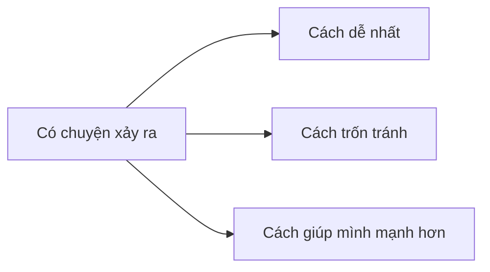

# Bài 1. Tính Cách Là Lựa Chọn Nhỏ

> Tuần 1  
> Tài nguyên liên quan: [Sổ Tay Thực Hành](/vi/resources/so-tay-thuc-hanh/), [Thuật Ngữ Dễ Hiểu](/vi/glossary/)

## Hôm nay mình học gì?

Sau bài này, mình có thể nhận ra rằng tính cách không chỉ là mình nói gì về bản thân, mà là cách mình chọn hành động trong những lúc khó, lúc không ai nhìn, hoặc lúc mình rất muốn đổ lỗi.

## Tình huống dễ gặp

Mình làm vỡ một chiếc cốc. Không ai nhìn thấy. Mình có thể:

- Im lặng và mong không ai biết.
- Nói là người khác làm.
- Nói thật: “Mình làm vỡ cốc. Mình xin lỗi. Mình sẽ dọn cẩn thận.”

Cách thứ ba có thể hơi khó. Nhưng đó là lúc tính cách của mình đang được rèn.

## Điều dễ hiểu nhầm

**Dễ nhầm:** “Tính cách là mình hướng nội, hướng ngoại, vui vẻ hay ít nói.”

**Cách hiểu rõ hơn:** Những điều đó là nét tự nhiên của mình. Còn **tính cách** trong bài này là cách mình chọn hành động khi có chuyện khó.

## Cách nghĩ mới

```text
Vấn đề không phải là mình lúc nào cũng phải làm đúng.
Vấn đề là khi mình sai, mình có dám nhìn thẳng và sửa không.
```

## Mình cần nhớ

| Tình huống | Phản ứng yếu | Phản ứng có bản lĩnh |
|---|---|---|
| Làm bài sai | “Mình dở quá.” | “Mình sai ở đâu để sửa?” |
| Bị nhắc | Cãi ngay | Dừng lại nghe phần đúng |
| Quên việc đã hứa | Đổ lỗi | Nhận phần của mình và sửa cách nhớ |
| Bạn bị chê cười | Cười theo | Không hùa theo, nếu được thì giúp bạn |
| Việc khó | Bỏ luôn | Chia nhỏ và thử một bước |

## Mô hình: Ngã ba lựa chọn

Khi có chuyện xảy ra, mình thường đứng ở một ngã ba:



Mình không cần chọn hoàn hảo ngay. Mình chỉ cần tập hỏi:

1. Cách nào dễ nhất?
2. Cách nào làm mình trốn trách nhiệm?
3. Cách nào giúp mình trở thành người tốt hơn?

## Mình thử làm

Đọc từng tình huống và viết 2 lựa chọn có thể xảy ra.

| Tình huống | Lựa chọn dễ | Lựa chọn có bản lĩnh |
|---|---|---|
| Mình bị điểm thấp hơn bạn | | |
| Mình đã hứa học 10 phút nhưng muốn xem video | | |
| Bạn bị cả nhóm chê | | |
| Mình bị bố/mẹ nhắc vì quên nhiệm vụ | | |

## Câu mình có thể nói

- “Mình cần nhìn lại phần mình làm chưa tốt.”
- “Mình chưa làm được, nhưng mình có thể sửa một bước.”
- “Mình chọn nói thật, dù hơi ngại.”
- “Mình không muốn trốn. Mình muốn học từ chuyện này.”

## Bài tập sau bài học

Tối nay, mình ghi vào sổ 2 câu:

1. Hôm nay mình đã có một lựa chọn tốt nào?
2. Nếu được làm lại một chuyện, mình muốn chọn khác ở điểm nào?

## Mình tự kiểm

| Câu hỏi | Có | Chưa rõ |
|---|---:|---:|
| Mình có giải thích được tính cách bằng lời của mình không? | □ | □ |
| Mình có nhận ra ít nhất một ngã ba lựa chọn trong ngày không? | □ | □ |
| Mình có chọn được một câu nói giúp mình chịu trách nhiệm hơn không? | □ | □ |

## Chốt lại

Tính cách không phải là một câu khen. Tính cách là những lựa chọn nhỏ mình lặp lại mỗi ngày.

