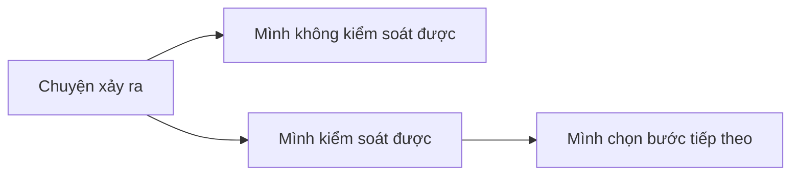

# Bài 3. Trách Nhiệm Là Phần Mình Có Thể Làm

> Tuần 2  
> Tài nguyên liên quan: [Thuật Ngữ Dễ Hiểu](/vi/glossary/), [Sổ Tay Thực Hành](/vi/resources/so-tay-thuc-hanh/)

## Hôm nay mình học gì?

Sau bài này, mình có thể phân biệt giữa **lý do** và **trách nhiệm**. Mình học cách nhận phần mình có thể làm mà không tự mắng mình quá nặng.

## Tình huống dễ gặp

Mình quên làm bài tập. Mình có thể nghĩ:

- “Tại cô giao nhiều.”
- “Tại bố mẹ không nhắc.”
- “Tại hôm qua mình mệt.”

Có thể những điều đó là một phần lý do. Nhưng câu hỏi quan trọng là:

```text
Phần nào là phần mình có thể làm tốt hơn lần sau?
```

## Điều dễ hiểu nhầm

**Dễ nhầm:** “Chịu trách nhiệm nghĩa là nhận hết lỗi về mình.”

**Cách hiểu rõ hơn:** Chịu trách nhiệm không phải là tự trách mình nặng nề. Chịu trách nhiệm là tìm phần mình có thể làm để sửa và tiến bộ.

## Cách nghĩ mới

```text
Vấn đề không phải là tìm ai đáng trách nhất.
Vấn đề là tìm phần mình có thể làm tốt hơn.
```

## Mô hình: Hai vòng tròn

| Mình không kiểm soát được | Mình kiểm soát được |
|---|---|
| Đề kiểm tra khó | Mình ôn bài và hỏi phần chưa hiểu |
| Trời mưa | Mình chuẩn bị áo mưa |
| Bạn nói điều không vui | Mình chọn cách trả lời |
| Máy tính lỗi | Mình báo người lớn và tìm cách khác |
| Bị điểm thấp | Mình xem lại lỗi và luyện lại |



## Câu mình cần tập

Thay vì nói:

- “Tại cô.”
- “Tại bạn.”
- “Tại con không biết.”

Mình tập nói:

- “Phần của mình là...”
- “Lần sau mình sẽ...”
- “Mình cần giúp ở chỗ...”
- “Mình chưa chuẩn bị đủ. Mình sẽ sửa bằng cách...”

## Mình thử làm

Chọn một chuyện gần đây không như ý và điền bảng:

| Câu hỏi | Mình trả lời |
|---|---|
| Chuyện gì đã xảy ra? | |
| Điều gì mình không kiểm soát được? | |
| Điều gì mình kiểm soát được? | |
| Phần trách nhiệm của mình là gì? | |
| Lần sau mình sẽ làm một việc gì khác? | |

## Ví dụ

| Câu hỏi | Mình trả lời |
|---|---|
| Chuyện gì đã xảy ra? | Mình quên vở bài tập. |
| Không kiểm soát được | Sáng nay nhà hơi vội. |
| Kiểm soát được | Tối qua mình có thể chuẩn bị cặp. |
| Trách nhiệm của mình | Mình chưa có thói quen kiểm tra cặp. |
| Lần sau | Mình kiểm tra cặp lúc 9 giờ tối. |

## Bài tập sau bài học

Trong 2 ngày tới, khi có chuyện không như ý, mình viết 3 dòng:

1. Chuyện gì xảy ra?
2. Phần mình có thể làm là gì?
3. Bước nhỏ tiếp theo là gì?

## Mình tự kiểm

| Câu hỏi | Có | Chưa rõ |
|---|---:|---:|
| Mình có phân biệt được lý do và trách nhiệm không? | □ | □ |
| Mình có dùng được câu “Phần của mình là...” không? | □ | □ |
| Mình có tránh tự mắng mình quá nặng không? | □ | □ |

## Chốt lại

Trách nhiệm không làm mình nhỏ đi. Trách nhiệm giúp mình lấy lại quyền sửa chuyện mình có thể sửa.

