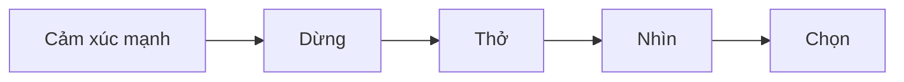

# Bài 6. Bình Tĩnh Trước Khi Phản Ứng

> Tuần 3  
> Tài nguyên liên quan: [Sổ Tay Thực Hành](/vi/resources/so-tay-thuc-hanh/), [Checklist Bản Lĩnh](/vi/resources/checklist-ban-linh/)

## Hôm nay mình học gì?

Sau bài này, mình có thể dùng cách **Dừng - Thở - Nhìn - Chọn** khi mình tức giận, xấu hổ, buồn hoặc thất vọng.

## Tình huống dễ gặp

Mình bị bạn trêu. Mặt mình nóng lên, tim đập nhanh, mình muốn nói lại thật gắt. Nếu nói ngay, có thể mọi chuyện tệ hơn.

Cảm xúc mạnh giống như một làn sóng. Mình không cần giả vờ là không có sóng. Mình học cách không để sóng cuốn mình đi.

## Điều dễ hiểu nhầm

**Dễ nhầm:** “Bình tĩnh nghĩa là không được tức giận.”

**Cách hiểu rõ hơn:** Mình được phép có cảm xúc. Bình tĩnh nghĩa là mình không để cảm xúc quyết định hết hành động của mình.

## Cách nghĩ mới

```text
Vấn đề không phải là mình có cảm xúc xấu.
Vấn đề là mình chọn hành động gì khi cảm xúc đang rất mạnh.
```

## Mô hình: Dừng - Thở - Nhìn - Chọn

| Bước | Mình làm gì? | Câu tự nói |
|---|---|---|
| Dừng | Không trả lời ngay | “Mình dừng lại đã.” |
| Thở | Hít sâu 3 lần | “Mình thở để não bình tĩnh hơn.” |
| Nhìn | Gọi tên cảm xúc | “Mình đang tức/xấu hổ/buồn.” |
| Chọn | Chọn hành động ít làm hỏng việc hơn | “Mình sẽ nói sau 5 phút.” |



## Những cảm xúc mình có thể gặp

| Cảm xúc | Dấu hiệu trong cơ thể | Việc nên tránh khi cảm xúc quá mạnh |
|---|---|---|
| Tức giận | Nóng mặt, nói nhanh | Nhắn tin hoặc nói lời làm đau người khác |
| Xấu hổ | Muốn trốn, cúi mặt | Tự gọi mình bằng lời nặng nề |
| Thất vọng | Mệt, muốn bỏ | Kết luận “mình chẳng làm được gì” |
| Buồn | Muốn im lặng | Giữ một mình quá lâu nếu chuyện rất nặng |

## Mình thử làm

Chọn một tình huống và điền:

| Tình huống | Mình muốn phản ứng ngay thế nào? | Nếu làm vậy, chuyện gì có thể xảy ra? | Cách bình tĩnh hơn |
|---|---|---|---|
| Bị bạn trêu | | | |
| Bị bố/mẹ nhắc | | | |
| Làm bài mãi không được | | | |
| Bị góp ý trước lớp | | | |

## Câu mình có thể nói

- “Mình đang tức, mình cần 5 phút.”
- “Mình nghe rồi, để mình nghĩ lại.”
- “Mình không muốn nói lời làm mọi chuyện tệ hơn.”
- “Mình cần giúp, nhưng mình muốn bình tĩnh trước.”

## Khi nào mình cần nhờ người lớn?

Nếu mình bị trêu chọc lặp lại, bị dọa, bị cô lập, bị làm tổn thương, hoặc cảm thấy không an toàn, mình cần nói với người lớn đáng tin. Bản lĩnh không phải là chịu đựng một mình.

## Bài tập sau bài học

Trong tuần này, mỗi khi có một cảm xúc mạnh, mình thử ghi:

| Chuyện xảy ra | Cảm xúc của mình | Mình đã dừng chưa? | Mình chọn hành động gì? |
|---|---|---:|---|
| | | □ | |

## Mình tự kiểm

| Câu hỏi | Có | Chưa rõ |
|---|---:|---:|
| Mình có nhớ 4 bước Dừng - Thở - Nhìn - Chọn không? | □ | □ |
| Mình có gọi tên được cảm xúc của mình không? | □ | □ |
| Mình có biết nhờ người lớn khi chuyện vượt quá sức không? | □ | □ |

## Chốt lại

Mình không chọn được cảm xúc xuất hiện. Nhưng mình có thể tập chọn hành động tiếp theo.

