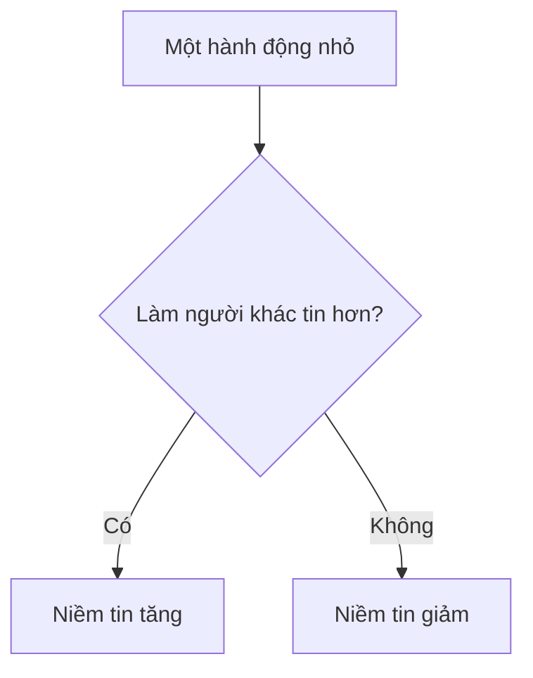

# Bài 7. Trung Thực Và Đáng Tin

> Tuần 4  
> Tài nguyên liên quan: [Checklist Bản Lĩnh](/vi/resources/checklist-ban-linh/), [Thuật Ngữ Dễ Hiểu](/vi/glossary/)

## Hôm nay mình học gì?

Sau bài này, mình có thể nhận ra điều gì làm người khác tin mình hơn hoặc bớt tin mình. Mình hiểu rằng niềm tin là một tài sản rất quý.

## Tình huống dễ gặp

Mình quên một việc đã hứa. Khi được hỏi, mình rất muốn nói:

- “Mình không biết.”
- “Tại người khác.”
- “Mình làm rồi mà.”

Nói vậy có thể giúp mình tránh bị nhắc ngay lúc đó. Nhưng nếu lặp lại nhiều lần, người khác sẽ khó tin mình hơn.

## Điều dễ hiểu nhầm

**Dễ nhầm:** “Trung thực là nói hết mọi điều trong đầu.”

**Cách hiểu rõ hơn:** Trung thực là không cố tình làm sai sự thật để trốn tránh, lấy lợi cho mình hoặc làm người khác hiểu sai.

## Cách nghĩ mới

```text
Vấn đề không phải là mình không bao giờ mắc lỗi.
Vấn đề là khi mắc lỗi, mình có nói thật và sửa không.
```

## Ngân hàng niềm tin

Hãy tưởng tượng giữa mình và người khác có một “tài khoản niềm tin”.

| Việc làm niềm tin tăng | Việc làm niềm tin giảm |
|---|---|
| Nói thật | Nói dối |
| Đúng giờ | Hứa rồi quên nhiều lần |
| Giữ lời | Đổ lỗi |
| Nhận lỗi | Giấu lỗi |
| Làm xong việc đã nhận | Chỉ làm khi bị nhắc nhiều lần |



## Người đáng tin trông như thế nào?

Người đáng tin không phải người lúc nào cũng làm đúng. Người đáng tin thường:

- Nói rõ điều mình làm được và chưa chắc làm được.
- Không hứa cho xong.
- Nếu quên, nói thật và sửa.
- Làm việc đã nhận, hoặc báo sớm nếu cần giúp.
- Không làm người khác phải nhắc quá nhiều.

## Mình thử làm

Chọn một mối quan hệ: bố/mẹ, thầy/cô, bạn thân, anh/chị/em.

| Câu hỏi | Mình trả lời |
|---|---|
| Người này thường tin mình ở việc gì? | |
| Việc gì có thể làm người này bớt tin mình? | |
| Một hành động nhỏ để tăng niềm tin là gì? | |
| Mình sẽ làm vào lúc nào? | |

## Câu mình có thể nói

- “Mình quên rồi. Mình xin lỗi. Mình sẽ làm ngay bây giờ.”
- “Mình chưa chắc làm được việc này, nên mình chưa muốn hứa vội.”
- “Mình cần thêm thời gian. Mình sẽ báo lại lúc...”
- “Mình đã sai ở chỗ... Lần sau mình sẽ...”

## Thử thách 7 ngày

Chọn một cam kết:

- Có mặt đúng giờ.
- Chuẩn bị đồ dùng trước khi được nhắc.
- Làm xong việc đã nhận.
- Nói thật khi mắc lỗi.
- Không hứa điều mình chưa chắc làm được.

| Ngày | Cam kết của mình | Mình đã giữ chưa? | Bằng chứng |
|---|---|---:|---|
| 1 | | □ | |
| 2 | | □ | |
| 3 | | □ | |
| 4 | | □ | |
| 5 | | □ | |
| 6 | | □ | |
| 7 | | □ | |

## Mình tự kiểm

| Câu hỏi | Có | Chưa rõ |
|---|---:|---:|
| Mình có hiểu niềm tin tăng hoặc giảm qua hành động nhỏ không? | □ | □ |
| Mình có biết nói thật khi mắc lỗi bằng câu rõ ràng không? | □ | □ |
| Mình có chọn được một cam kết 7 ngày không? | □ | □ |

## Chốt lại

Người đáng tin không phải người không bao giờ sai. Người đáng tin là người sai nhưng không trốn.

