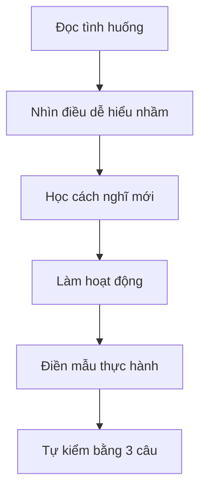

# Bản Đồ Giáo Trình

## Lộ trình 4 tuần

| Tuần | Bài | Mình học điều gì? | Sản phẩm nhỏ |
|---|---:|---|---|
| Tuần 1 | 1 | Tính cách là lựa chọn lặp lại | 3 lựa chọn tốt trong ngày |
| Tuần 1 | 2 | Mình muốn trở thành người như thế nào | 5 phẩm chất mình muốn rèn |
| Tuần 2 | 3 | Trách nhiệm là phần mình có thể làm | Bảng hai vòng tròn |
| Tuần 2 | 4 | Kỷ luật là giữ lời hứa nhỏ | Lời hứa 7 ngày |
| Tuần 3 | 5 | Chưa làm được là dữ liệu để thử tiếp | Bảng 3 lần thử |
| Tuần 3 | 6 | Cảm xúc không xấu, phản ứng mới cần chọn | Phiếu Dừng - Thở - Nhìn - Chọn |
| Tuần 4 | 7 | Niềm tin là tài sản quý | Ngân hàng niềm tin |
| Tuần 4 | 8 | Mình viết quy tắc bản lĩnh của mình | Bộ Quy Tắc Bản Lĩnh |

## Bản đồ bài học

| Bài | File | Trọng tâm | Tài nguyên dùng kèm | Tự kiểm |
|---:|---|---|---|---|
| 1 | [Tính cách là lựa chọn nhỏ](/vi/lessons/01-tinh-cach-la-lua-chon-nho/) | Chọn cách phản ứng khi gặp việc khó | [Sổ tay thực hành](/vi/resources/so-tay-thuc-hanh/) | 3 câu cuối bài |
| 2 | [Mình muốn trở thành người như thế nào](/vi/lessons/02-minh-muon-tro-thanh-nguoi-nhu-the-nao/) | Chọn phẩm chất muốn rèn | [Checklist bản lĩnh](/vi/resources/checklist-ban-linh/) | Bảng 5 phẩm chất |
| 3 | [Trách nhiệm là phần mình có thể làm](/vi/lessons/03-trach-nhiem-la-phan-minh-co-the-lam/) | Không đổ lỗi, không tự trách quá mức | [Thuật ngữ dễ hiểu](/vi/glossary/) | Hai vòng tròn |
| 4 | [Kỷ luật là giữ lời hứa nhỏ](/vi/lessons/04-ky-luat-la-giu-loi-hua-nho/) | Tập giữ lời với bản thân | [Sổ tay thực hành](/vi/resources/so-tay-thuc-hanh/) | Bảng 7 ngày |
| 5 | [Không bỏ cuộc quá sớm](/vi/lessons/05-khong-bo-cuoc-qua-som/) | Thử 3 cách trước khi nói không làm được | [Sổ tay thực hành](/vi/resources/so-tay-thuc-hanh/) | Phiếu 3 lần thử |
| 6 | [Bình tĩnh trước khi phản ứng](/vi/lessons/06-binh-tinh-truoc-khi-phan-ung/) | Chọn hành động khi cảm xúc mạnh | [Sổ tay thực hành](/vi/resources/so-tay-thuc-hanh/) | Phiếu cảm xúc |
| 7 | [Trung thực và đáng tin](/vi/lessons/07-trung-thuc-va-dang-tin/) | Xây tài khoản niềm tin | [Checklist bản lĩnh](/vi/resources/checklist-ban-linh/) | Ngân hàng niềm tin |
| 8 | [Bộ Quy Tắc Bản Lĩnh Của Mình](/vi/lessons/08-bo-quy-tac-ban-linh-cua-minh/) | Tổng kết và chọn nguyên tắc sống | [Dự Án 30 Ngày](/vi/projects/du-an-30-ngay/) | Bộ quy tắc |

## Tài nguyên chính

- [Sổ Tay Thực Hành](/vi/resources/so-tay-thuc-hanh/): nơi mình ghi nhật ký, lời hứa, 3 lần thử và cách xử lý cảm xúc.
- [Checklist Bản Lĩnh](/vi/resources/checklist-ban-linh/): bảng kiểm nhanh mỗi ngày và mỗi tuần.
- [Thuật Ngữ Dễ Hiểu](/vi/glossary/): nơi giải thích các từ dễ nhầm.
- [Tự Đánh Giá](/vi/assessments/): bảng tự xem mình đang tiến bộ ở đâu.
- [Dự Án 30 Ngày](/vi/projects/du-an-30-ngay/): thử thách sau khóa để biến bài học thành hành động.
- [Phụ Huynh Đồng Hành](/vi/phu-luc/phu-huynh-dong-hanh/): phần riêng cho bố/mẹ.

## Cách học một bài

## Mình hoàn thành khóa khi

- Mình đã đọc đủ 8 bài.
- Mình có ít nhất 7 ngày ghi nhật ký 5 phút.
- Mình đã chọn và theo dõi một lời hứa nhỏ.
- Mình đã viết Bộ Quy Tắc Bản Lĩnh Của Mình.
- Mình đã chọn một Dự Án 30 Ngày vừa sức.

