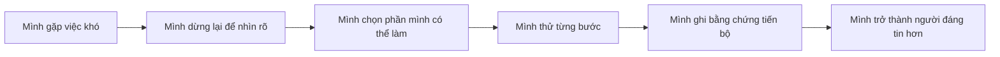

# Bản Lĩnh Tạo Nên Thành Công

## Dành cho mình

Đây là sổ tay 4 tuần dành cho một bạn gái 12 tuổi đang lớn lên, đang học cách hiểu mình, giữ lời với mình, bình tĩnh hơn khi gặp chuyện khó và trở thành người đáng tin.

Mình không học cuốn này để trở thành một người hoàn hảo.

Mình học để biết:

- Khi mình làm sai, mình có thể sửa.
- Khi mình chưa làm được, mình có thể thử từng bước.
- Khi mình buồn, tức giận hoặc xấu hổ, mình không cần phản ứng vội.
- Khi mình hứa một điều nhỏ, mình có thể tập giữ lời.
- Khi người khác tin mình, đó là một điều rất quý.

## Lời hứa của chương trình

Sau 4 tuần, mình có thể tự chọn cách phản ứng tốt hơn trong những tình huống khó ở trường, ở nhà và với bạn bè. Mình sẽ tạo được **Bộ Quy Tắc Bản Lĩnh Của Mình** và bắt đầu một **Dự Án 30 Ngày** vừa sức.

## Điều quan trọng nhất

```text
Mình không cần giỏi nhất.
Mình không cần thắng tất cả.
Mình không cần lúc nào cũng đúng.

Mình cần học cách đứng về phía điều đúng,
ngay cả khi điều đó hơi khó.
```

## Bản lĩnh là gì?

**Bản lĩnh** là cách mình chọn hành động khi gặp việc khó.

Ví dụ:

| Tình huống | Cách dễ nhưng yếu | Cách có bản lĩnh |
|---|---|---|
| Mình làm bài sai | “Mình dở quá.” | “Mình sai ở đâu để sửa?” |
| Mình bị nhắc | Giận hoặc cãi ngay | Dừng lại, nghe phần đúng |
| Mình quên bài tập | Đổ lỗi cho người khác | Nhận phần của mình và sửa cách chuẩn bị |
| Mình thấy việc khó | Bỏ luôn | Chia nhỏ và thử từng bước |
| Mình mắc lỗi | Giấu đi | Nói thật, sửa lỗi |

## Công thức mình cần nhớ

```text
Năng lực giúp mình bắt đầu.
Bản lĩnh giúp mình đi đến cùng.
```

Và:

```text
Chưa làm được không có nghĩa là mình không làm được.
Nó chỉ có nghĩa là mình chưa tìm ra cách.
```

## Cách học trong 4 tuần

- Mỗi tuần học 2 bài.
- Mỗi bài khoảng 35 đến 45 phút.
- Mỗi ngày thực hành 5 đến 10 phút bằng sổ tay.
- Không cần làm thật nhiều. Cần làm đều và thật.

## Mình sẽ làm được

1. Nói được tính cách và bản lĩnh là gì bằng lời của mình.
2. Chọn 5 phẩm chất mình muốn rèn.
3. Phân biệt được lý do và trách nhiệm.
4. Giữ một lời hứa nhỏ trong 7 ngày.
5. Dùng cách “3 lần thử” trước khi bỏ cuộc.
6. Dùng cách “Dừng - Thở - Nhìn - Chọn” khi cảm xúc mạnh.
7. Biết điều gì làm người khác tin hoặc bớt tin mình.
8. Viết được Bộ Quy Tắc Bản Lĩnh Của Mình.
9. Bắt đầu Dự Án 30 Ngày để chứng minh mình đang tiến bộ.

## Sản phẩm cuối khóa

Cuối khóa, mình sẽ có:

- Một Bộ Quy Tắc Bản Lĩnh Của Mình.
- Một bảng tự đánh giá trước và sau khóa.
- Một nhật ký 5 phút mỗi ngày.
- Một lời hứa 7 ngày đã được theo dõi.
- Một kế hoạch Dự Án 30 Ngày.

## Sơ đồ hành trình



## Quy tắc an toàn khi học

- Mình được phép sai.
- Mình không dùng bài học này để tự mắng mình.
- Mình không ép mình chịu đựng những chuyện làm mình đau hoặc sợ.
- Nếu có chuyện quá khó, mình nói với người lớn đáng tin.
- Bản lĩnh không phải là im lặng chịu hết. Bản lĩnh là biết chọn điều đúng và biết nhờ giúp đỡ khi cần.

## Cách dùng bộ file này

1. Đọc [Bản Đồ Giáo Trình](/vi/lo-trinh/).
2. Học từng bài trong thư mục [lessons](/vi/lessons/).
3. Dùng [Sổ Tay Thực Hành](/vi/resources/so-tay-thuc-hanh/) mỗi ngày.
4. Tra từ khó trong [Thuật Ngữ Dễ Hiểu](/vi/glossary/).
5. Tự đánh giá bằng [Tự Đánh Giá](/vi/assessments/).
6. Làm [Dự Án 30 Ngày](/vi/projects/du-an-30-ngay/) sau bài 8.

